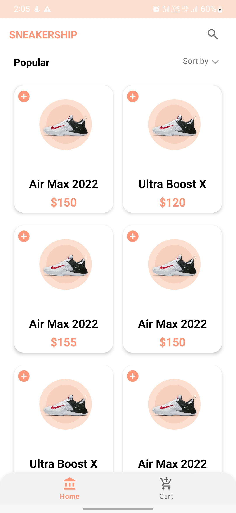
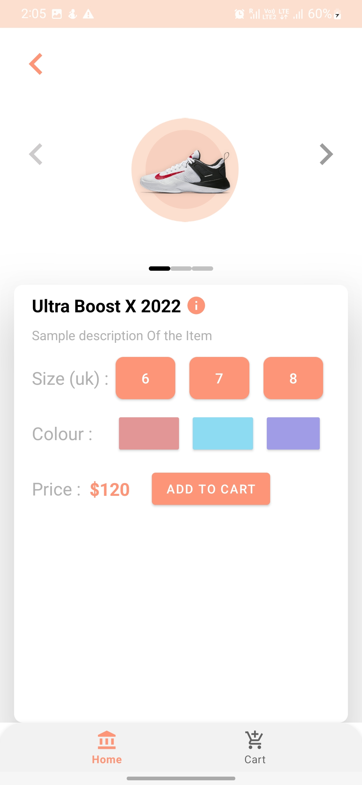
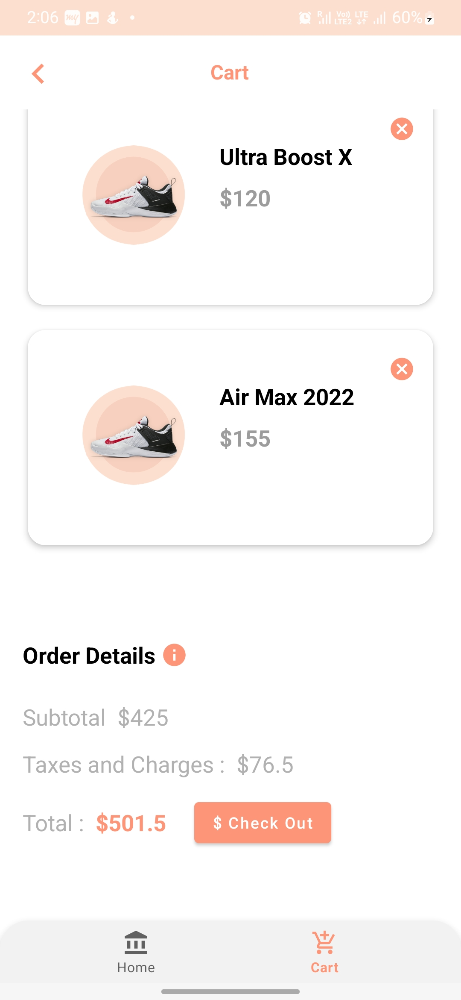

# Sneaker Ship App

Welcome to the Sneaker Ship App, a mobile application designed to showcase and manage a collection of top 100 sneakers.

## Features

### Display Top 100 Sneakers
- Display a grid with a column size of 2.
- Each item in the grid contains the image, price, and name of the sneaker.
- Search feature for easy navigation.

### Sneaker Details Page
- Tap on a sneaker item to view its details.
- Details include title, name, image, brand, year of release, and price.
- Add to Cart button for quick shopping.

### Checkout Page
- View all added sneakers in a list with images and prices.
- Remove items from the cart.
- Total price calculation for all items.

## Architecture and Libraries Used
- MVVM architecture
- ViewBinding for efficient UI binding
- ViewPager for smooth navigation
- Bottom Navigation for easy access
- SearchView for quick searching
## Screenshots

<p float="left">
  
  
  
</p>
*Captions: (Left) Sneaker grid with search feature, (Center) Detailed information about a selected sneaker with an "Add to Cart" button, (Right) Cart page displaying added sneakers with a total price.*

## Getting Started

1. Clone the repository:

```bash
https://github.com/EMMANUELABRAHAM/Sneakershiprepo.git
